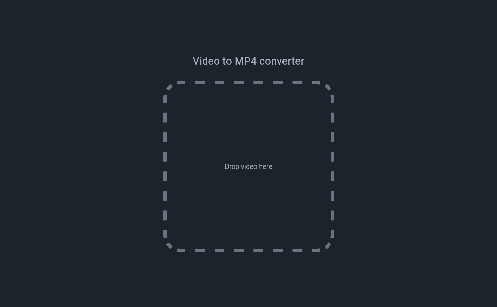
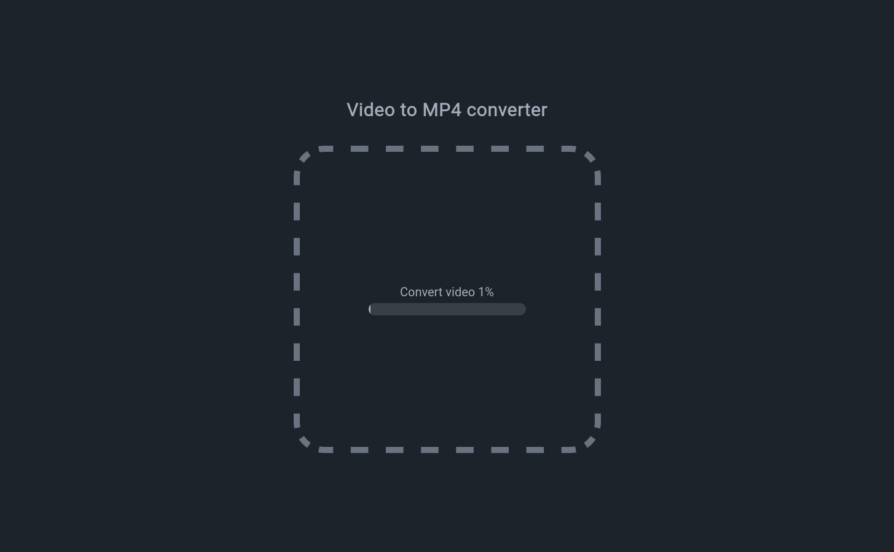
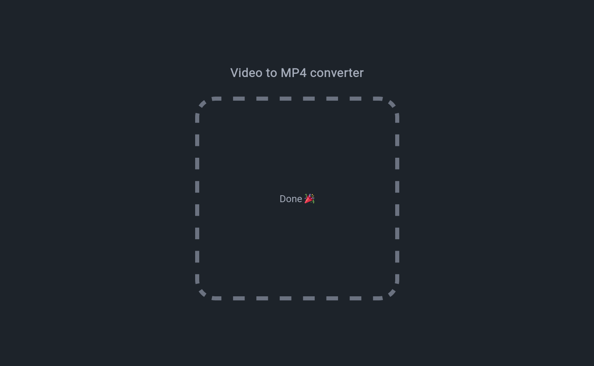

Website convert video to mp4 format using svelte and [ffmpeg.wasm](https://github.com/ffmpegwasm/ffmpeg.wasm)

Check out the tutorial by Joy of Code: [Make A Video Converter With Svelte And FFmpeg In The Browser](https://www.youtube.com/watch?v=lHcnhSgKgyM)

Screenshots:

- Main ui:

- When convert video:

- When done:

